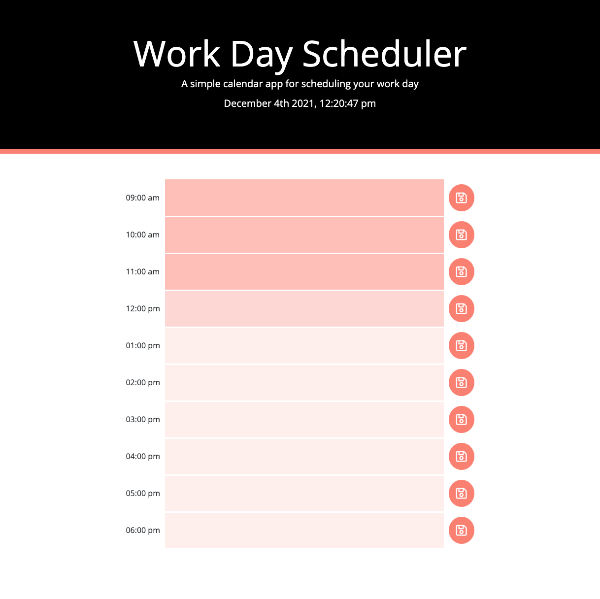
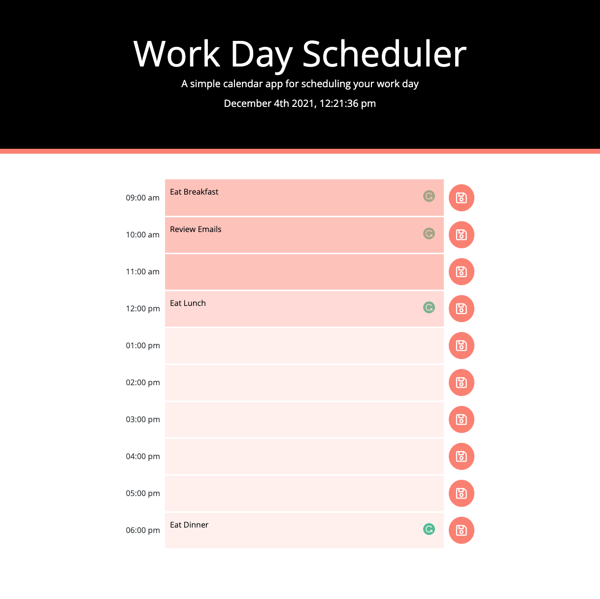

# Daily-Planner

## Overview

Program a daily planner that an employee with a busy schedule can use to organize their work day, and thus manage their time more effectively.  


## The Project

The daily planner was built using HTML, CSS, javascript, jQuery and moment.js, and is accessibile via the browser. 

When the employee accesses the daily planner, they are able to view the current date and time, and a table containing each work hour (9am - 6pm), a text area to enter the event, and a button to save the event. 

Upon clicking the button, the event entered for the specific time, is saved to local storage. Employee is able to continue to view the event for the specific time slot even after they refresh the page. 

Additionally, time slots have varying shades of a color, helping the employee easily determine at a glance hours that are in the past, present, and in the future.  


## Road Blocks

Before beginning the project, I began thinking through the requirements and writing out pseudocode. Based on my current understanding of javascript, there were a few things I knew I needed to include in the application's code: moment.js to display the time and format the hour, local storage, if/else statements. The table, time, text area, and buttons could be created in the HTML, but I opted to create the elements dynamicall. 

Seemed simple enough, but there were a few bumps in the road: 

- How do I save each entry to its specific time block based on the click of its corresponding button, without listing each individual time block?
- How do I create a button element with an icon?


###### Storing Entries 

There seemed to be several different ways to solve this issue. Many, however, involved several lines of code. By placing the following code within the loop, I was able to save and display each entry to its specific row. In simple terms, if there was text in a textarea, the application gets it from storage and displays it as `textContent`. 

In working out the solution to this problem, I learned that localStorage can only store strings. The hour was not a string, but I was able to convert it into one using the `toString()` method.

    ```
        variable = hour.toString();

        storedValue = localStorage.getItem(variable);

        if(storedValue) {
        tdTextArea.textContent = storedValue; 
        }
    ```


###### Button Icon

This nifty piece of jQuery code allowed me to add an icon to the dynamically created button. 

    ```
        tdButton = $('<button>');
        $(tdButton).html("<i class='far fa-save'></i>");
    ```

## That's a wrap

After some trial and error, office hours attendance, Googling, tutoring and studying, the code locked into place and the application operates as per the requirements.  


## Take a Look

GitHub: https://github.com/jsamborski310/Daily-Planner

GitHub Pages: https://jsamborski310.github.io/Daily-Planner/


## The Preview

Here's a live screencast of the daily planner in action: 

https://www.loom.com/share/dd88f8fd3a0d42ce8f6662433dbc6e04


###### Daily Planner





###### Daily Planner with Plans



